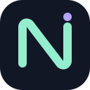
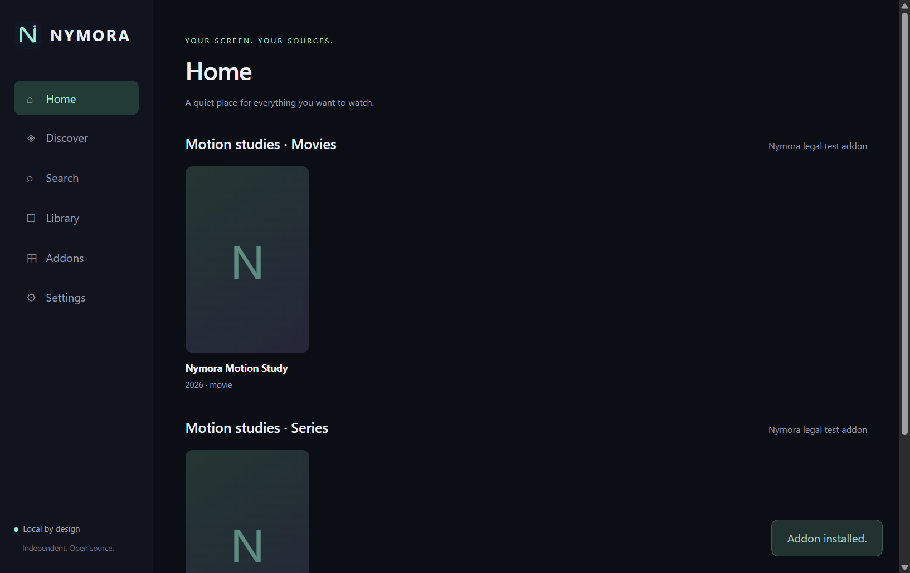
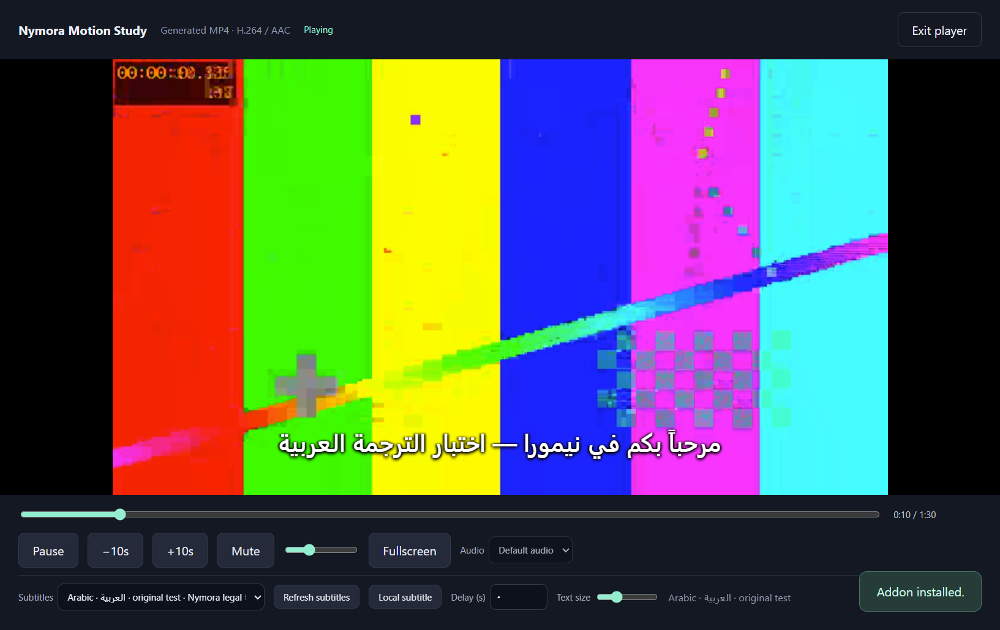

<p align="center"></p>

# NYMORA

**Version 1.0.1 Alpha · Windows x64 · Independent open-source media client**

Bring your own compatible addons. Browse their catalogs, search for a title, choose a movie or episode and play a supported stream inside the desktop application. Your library, addons and viewing progress stay on your computer.

Nymora is an independent project, not affiliated with, sponsored by or endorsed by Stremio. It reuses selected MIT-licensed Stremio addon-client components and follows the HTTP addon protocol. It does not provide or host movies or television content. Third-party addons are independently maintained services.

**Release status:** The requested [1.0.1 Alpha](https://github.com/igc27/Nymora/releases/tag/v1.0.1) provides local, free, consent-gated BitTorrent playback in the existing player, with improved default video selection. See [1.0.1 P2P verification](docs/P2P_QA-1.0.1.md). The previously published [1.0.0](https://github.com/igc27/Nymora/releases/tag/v1.0.0) and [1.1.0](https://github.com/igc27/Nymora/releases/tag/v1.1.0) releases remain available.

## Windows installation

Use the [1.0.1 Alpha release](https://github.com/igc27/Nymora/releases/tag/v1.0.1). Download `Nymora-1.0.1-Windows-x64-Setup.exe`, compare its SHA-256 value with `SHA256SUMS.txt`, and run it. The installer supports a per-user installation, Start Menu and optional desktop shortcuts, and uninstall through Windows Settings. Windows 10/11 x64 is the target; Windows 11 was tested. Releases are currently unsigned. Other versions remain on the [GitHub Releases page](https://github.com/igc27/Nymora/releases).

An optional versioned Windows x64 Portable ZIP contains the same desktop client. Extract it before launching `Nymora.exe`. Portable mode uses the ordinary local data folder unless `NYMORA_DATA_DIR` is explicitly set.

## Core experience

* **Addons:** install a manifest URL, inspect its version/description/resources/types, open a supported configuration page, and remove it. Addons persist across restarts. No addons are preinstalled.
* **Home and Discover:** catalog rows come from installed addons; choose catalogs, declared filters and pagination. Search-only/required-filter catalogs are queried with their required extras.
* **Search and details:** query search-enabled catalogs; display available metadata without inventing missing fields. Series list seasons/episodes and request streams using the exact episode video ID.
* **Playback:** supported HTTP(S), HLS and BitTorrent v1 infoHash/magnet sources inside the same player, with play/pause, seeking, timeline, volume/mute and native fullscreen. Audio tracks are selectable when exposed by the source/player. P2P sources require fresh confirmation for every session.
* **Subtitles:** addon and stream subtitle results, English/Arabic/other Unicode text, automatic text direction, local UTF-8 SRT/WebVTT/ASS/SSA files, on/off/switching, size, delay and remembered language. ASS/SSA is rendered as plain text.
* **Local library and progress:** save/remove movies and series, mark watched/unwatched, store per-episode positions, and return through Continue Watching. No Nymora account or paid infrastructure.

Actual playback and subtitle verification evidence is recorded in [docs/QA.md](docs/QA.md). Screenshots in `docs/screenshots/` are captured from the running client using only original developer-generated test media.





## Installing an addon

Open **Addons**, paste the addon developer's HTTP(S) URL ending in `/manifest.json`, and choose **Install addon**. Configured addons can place configuration in the URL path. Standard `catalog`, `meta`, `stream` and `subtitles` resources are supported, including resource-specific types and ID prefixes. The app lists streams supplied by your installed addons and passes the selected HTTP source to the player. It can query separate metadata, stream and subtitle addons for the same ID.

Use only sources you are authorized to access. Addon developers are responsible for their independent services. No piracy addon collection, copyrighted media index, movie service credentials, DRM circumvention or media files are bundled with Nymora.

## Playback and compatibility

The desktop client bundles its UI; it does not launch a hosted website. Electron's Chromium video engine and `hls.js` supply playback. A temporary token-protected loopback proxy supports byte ranges, relative HLS paths and selected addon request headers without depending on addon CORS. WebTorrent supplies the BitTorrent backend and prioritizes requested video pieces through a separate token-protected local HTTP endpoint. Missing/unsupported sources show an error and let you choose another source.

Support depends on Chromium's codecs and addon behavior. Direct MP4/WebM/HLS and real infoHash/magnet torrent streaming are tested using original legal video. IPFS/legacy addon transports, BitTorrent v2-only magnets, DRM streams, external-service-only streams and codecs not supported by Chromium are unsupported. Optional uTP transport is omitted; TCP peers, DHT, peer exchange and supplied HTTP(S)/UDP trackers are supported. WebRTC peer interoperability is not independently tested. In-band subtitle/audio tracks are selectable when the player exposes them. Advanced ASS styling and non-UTF-8 subtitle detection are not implemented. The UI is English; Arabic subtitles work independently of UI localization. There is no account, sync, automatic updater or built-in addon marketplace.

## P2P Streaming Notice

Selecting any infoHash, magnet URI or backend-marked P2P source opens a native **P2P Streaming Notice** with **Cancel** and **I Understand — Play**. No torrent engine, peer discovery, metadata exchange, downloading, uploading or playback starts until the native dialog returns an explicit acceptance. Cancel, Escape or closing the notice returns to the source list. There is no remembered blanket consent, and an addon cannot supply a consent flag.

The notice explains that the device may download and upload pieces, its IP may be visible to peers, and users must ensure that they are authorized to access the content. Availability and legality depend on the source and applicable laws. The notice does not grant copyright permission. Nymora remains a neutral client; third-party addons and sources are independently provided.

After acceptance, the interface shows Connecting to peers, Fetching torrent metadata, Finding video file and Buffering as the real backend advances, then opens the internal player. Supplied fileIdx, filename, videoSize and tracker/DHT hints guide selection; metadata is not fabricated. Seeking prioritizes future byte ranges without waiting for a complete download. English/Arabic subtitles and playback progress work through the existing player. Ending or exiting playback closes the P2P session.

Settings shows the owned torrent cache size and offers a limit and clear control. The default is 2 GiB; the selected video plus piece padding must fit the configured limit. Closed session pieces remain until cleared or replaced by the next session. Clearing requires an inactive session and preserves unrelated files. Torrent filenames never become disk paths. No content trackers, indexes or addons are preinstalled; discovery uses the selected source's hints and generic protocol bootstrap.

## Build from source

Requirements: Windows x64, Node.js 24 and npm, internet access for packages and the official Electron/NSIS build tools. FFmpeg is required **only** to generate legal QA media for end-to-end tests; the application does not distribute or require an external FFmpeg executable. The icon is already included; Pillow is needed only if regenerating it with `scripts/icon.py`.

```powershell
git clone https://github.com/igc27/Nymora.git
cd Nymora
npm ci
npm run lint
npm test
npm run notices
npm run build
npm start
```

Create the Windows installer and portable ZIP:

```powershell
npm run package
```

Outputs appear in `release/`. The source includes the lockfile, original assets, vendored addon-client source, licenses and build scripts. Electron/Chromium license files remain beside the packaged executable. CI runs lint, unit tests, build, runtime dependency audit and desktop end-to-end tests. The release workflow tests the packaged executable before producing a draft release.

## Legal end-to-end development test

Install FFmpeg from its official distribution or your trusted package manager, or set `FFMPEG_PATH` to an existing executable. Generate the original motion study and run the full desktop test:

```powershell
npm run test:media
npm run build
npm run test:e2e
npm run test:p2p
```

These tests use a real local addon and original generated media. HTTP tests verify browsing, decoded MP4/WebM/HLS playback, subtitles and progress. P2P tests add a real loopback BitTorrent tracker/seeder, deferred explicit native-dialog decisions, zero pre-consent activity, partial playback, seeking, pause/resume, subtitles, restart progress and session/cache cleanup. `npm run test:p2p:native` is an interactive supplementary test of the actual Windows notice: cancel the first prompt, then accept the second. No unauthorized commercial stream or public content index is used.

To inspect the developer test addon manually, run `npm run demo` in a second terminal and install the printed manifest URL in Nymora. The test addon is never installed automatically. Its ephemeral port is valid while that server is running. For packaged testing:

```powershell
$env:NYMORA_TEST_EXE = (Resolve-Path release/win-unpacked/Nymora.exe).Path
npm run test:e2e
npm run test:p2p
```

## Privacy and security

Viewing data, addon configuration and preferences are stored in `%APPDATA%/Nymora/nymora.json` (the exact folder is shown in Settings). Nymora has no telemetry or Nymora-controlled viewing-history server. Addons and stream/subtitle hosts see requests you send to them. After P2P acceptance, trackers and other peers may see your IP and the torrent's infoHash. Downloaded pieces may be uploaded during that session. Configured addon paths may include private keys; do not post them in public bug reports.

The renderer is sandboxed without Node access. Addon data cannot execute OS shell commands, and metadata is rendered as text. See [SECURITY.md](SECURITY.md) for the security model and vulnerability reporting.

## Licensing and upstream attribution

Original Nymora modifications, branding, interface and project-specific code: **MIT**, Copyright © 2026 Mohammed Alanazi. Reused Stremio addon-client code: **MIT**, Copyright © 2019 SmartCode OOD. WebTorrent/tracker work remains **MIT**, Copyright (c) Feross Aboukhadijeh and WebTorrent LLC. Upstream copyright and full license notices are preserved. Electron/Chromium, `hls.js`, native WebRTC dependencies and build tools retain their respective licenses. MPL corresponding-source references are provided in [third_party/NATIVE_SOURCE.md](third_party/NATIVE_SOURCE.md).

See [LICENSE](LICENSE), [THIRD_PARTY_NOTICES.md](THIRD_PARTY_NOTICES.md), [OPEN_SOURCE_AUDIT.md](OPEN_SOURCE_AUDIT.md), [CONTRIBUTORS.md](CONTRIBUTORS.md) and [docs/UPSTREAM.md](docs/UPSTREAM.md) for exact origins, revisions, redistribution obligations and future upstream review. Nymora does not claim authorship of upstream code.

See [CHANGELOG.md](CHANGELOG.md), [ROADMAP.md](ROADMAP.md) and [docs/QA.md](docs/QA.md) for shipped changes, future work and verification limits.
